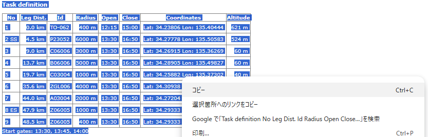
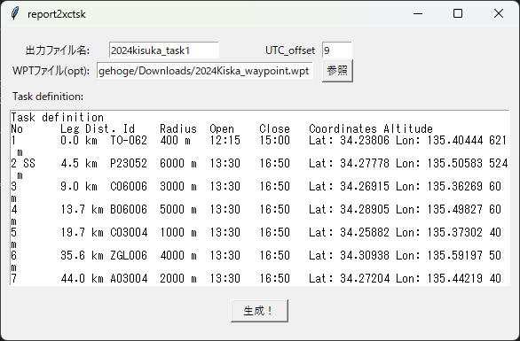

# report2xctsk
タスクレポートの"Task definition"からXC_Track用のタスクファイルを生成するプログラム

## 使用方法

- タスクレポートの以下箇所をコピー

- 貼り付ける。
出力ファイル名は拡張子不要。

- WPTファイルがある場合は指定する。WPTファイルからWPTの説明を取ってくる。指定しなくても良いが、その場合WPTの説明が***となる。

- pyファイルと同じ場所に出力される

## できること
- タイムゲート、エラップスに対応
- 複数スタート時間に対応

## ToDo
